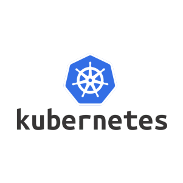

# DEVOPS
<table border="0">
    <tr>
    <td><a href="https://console.cloud.google.com/">
    
    </a>
    </td>
    <td>
    <a href="https://kubernetes.io/">
    
    </a>
    </td>
    <td>
    <a href="https://www.docker.com/">
    
    </a>
    </td>
    <td>
    <a href="https://rancher.com/">
    
    </td>
    </a>
    <td>
    <a href="https://longhorn.io/">
    
    </td>
    </a>
    </tr>
<table>
<table border="0">
<tr>
<td>
    <a href="https://docs.traefik.io/">
    
    </a>
    </td>
    <td>
    <a href="https://istio.io/">
    
    </a>
    </td>
    <td>
    <a href="https://www.graylog.org/">
    
    </a>
    </td>
    <td>
    <a href="https://grafana.com/">
    
    </a>
    </td>
    <td>
    <a href="https://prometheus.io/">
    
    </a>
    </td>
    <td>
    <a href="https://helm.sh/">
    
    </a>
    </td>
    </tr>
</table>

## **SUMÁRIO**

- [ARQUITETURA](#arquitetura)
- [DOMÍNIO](#dominio)
- [CONFIGURAÇÕES GOOGLE CLOUD](#config)
- [RANCHER - SINGLE NODE](#rancher)
- [KUBERNETES](#kubernetes)
- [TRAEFIK - DNS](#traefik)
- [LONGHORN - VOLUMES](#longhorn)
- [GRAYLOG - LOG](#graylog)
- [GRAFANA/PROMETHEUS - MONITORAMENTO](#grafana)
- [KUBERNETES - RECURSOS](#recursos)

GRAFANA/PROMETHEUS - MONITORAMENTO

<a id="arquitetura"></a>
## ARQUITETURA


<a id="dominio"></a>
## DOMÍNIO

```
Criar domínio: https://registro.br/
```
### Configurar servidores de DNS do google cloud no registro.br


<a id="config"></a>
## CONFIGURAÇÕES GOOGLE CLOUD

### Criação das instâncias

```
rancher-server: Ubuntu, e2-standard-4 (4 vCPUs, 16 GB de memória), Disco permanente SSD de 30GB.
k8s-1: Ubuntu, e2-standard-2 (2 vCPUs, 8 GB de memória), Disco permanente SSD de 30GB.
k8s-2: Ubuntu, e2-standard-2 (2 vCPUs, 8 GB de memória), Disco permanente SSD de 30GB.
k8s-3: Ubuntu, e2-standard-2 (2 vCPUs, 8 GB de memória), Disco permanente SSD de 30GB.
```


### Configurações do DNS


<a id="docker"></a>
## INSTALAÇÃO DO DOCKER

```
É preciso entrar em todas as máquinas e instalar o Docker.
```

```
$ sudo su
$ curl https://releases.rancher.com/install-docker/18.09.sh | sh
$ usermod -aG docker ubuntu
```
### Instalação docker-compose

```
$ sudo su
$ apt-get install git -y
$ curl -L "https://github.com/docker/compose/releases/download/1.25.5/docker-compose-$(uname -s)-$(uname -m)" -o /usr/local/bin/docker-compose
$ chmod +x /usr/local/bin/docker-compose
$ ln -s /usr/local/bin/docker-compose /usr/bin/docker-compose
```

<a id="rancher"></a>
## INSTALAÇÃO DO RANCHER - SINGLE NODE

Entrar no host, que será usado para hospedar o Rancher Server.

```
$ docker ps -a
$ docker run -d --name rancher --restart=unless-stopped -v /opt/rancher:/var/lib/rancher  -p 80:80 -p 443:443 rancher/rancher:latest
```
Acessar e configurar:

```
https://rancher.<dominio>/
```
<a id="kubernetes"></a>
## INSTALAÇÃO DO KUBERNETES

No rancher, adicionar o cluster e depois o rancher irá exibir um comando de docker run, para adicionar os host's (k8s-1 e k8s-2). Obs: deixar o Nginx Ingress (Aba - Advanced Options) desabilitado, pois será criado um.

Executar o comando que vai ser gerado pelo rancher durante a criação do cluster, para cada host gerenciado (k8s-1 e k8s-2):

Obs: adicionar sempre: etcd, controlplane, worker

```
k8s-1: 
sudo docker run -d --privileged --restart=unless-stopped --net=host -v /etc/kubernetes:/etc/kubernetes -v /var/run:/var/run rancher/rancher-agent:v2.4.7 --server https://rancher.<dominio> --token rvdgt4882qg84w244jshfm2tc7g5phjkrhnsrhfh8l69bwtxdghvqp --ca-checksum 2ee13e4c57c9f9ca6eda2c5f6707bb54148e63c026fd17cefbacb5dd501f6d23 --node-name k8s-1 --etcd --controlplane --worker

k8s-2: 
sudo docker run -d --privileged --restart=unless-stopped --net=host -v /etc/kubernetes:/etc/kubernetes -v /var/run:/var/run rancher/rancher-agent:v2.4.7 --server https://rancher.<dominio> --token rvdgt4882qg84w244jshfm2tc7g5phjkrhnsrhfh8l69bwtxdghvqp --ca-checksum 2ee13e4c57c9f9ca6eda2c5f6707bb54148e63c026fd17cefbacb5dd501f6d23 --node-name k8s-2 --etcd --controlplane --worker

k8s-3: 
sudo docker run -d --privileged --restart=unless-stopped --net=host -v /etc/kubernetes:/etc/kubernetes -v /var/run:/var/run rancher/rancher-agent:v2.4.7 --server https://rancher.<dominio> --token rvdgt4882qg84w244jshfm2tc7g5phjkrhnsrhfh8l69bwtxdghvqp --ca-checksum 2ee13e4c57c9f9ca6eda2c5f6707bb54148e63c026fd17cefbacb5dd501f6d23 --node-name k8s-3 --etcd --controlplane --worker
```

Será um cluster com 2 nós. Navegar pelo Rancher e ver os painéis e funcionalidades.

### Instalar kubectl no host rancher-server

```
$ sudo apt-get update && sudo apt-get install -y apt-transport-https gnupg2
$ curl -s https://packages.cloud.google.com/apt/doc/apt-key.gpg | sudo apt-key add -
$ echo "deb https://apt.kubernetes.io/ kubernetes-xenial main" | sudo tee -a /etc/apt/sources.list.d/kubernetes.list
$ sudo apt-get update
$ sudo apt-get install -y kubectl
```

Com o kubectl instalado, pegar as credenciais de acesso no Rancher e configurar o kubectl (pegar o dados do arquivo - Kubeconfig File no cluster criado).

```
$ cd /home/ubuntu
$ mkdir -p ~/.kube
$ vi ~/.kube/config
$ kubectl get nodes
```
<a id="traefik"></a>
## INSTALAÇÃO DO TRAEFIK - DNS

```
*.rancher.<dominio>
```

O Traefik é a aplicação que será usada como ingress. Ele irá ficar escutando pelas entradas de DNS que o cluster deve responder. Ele possui um dashboard de monitoramento e com um resumo de todas as entradas que estão no cluster.

Executar os comandos no host (rancher-server):

```
$ kubectl apply -f https://raw.githubusercontent.com/containous/traefik/v1.7/examples/k8s/traefik-rbac.yaml
$ kubectl apply -f https://raw.githubusercontent.com/containous/traefik/v1.7/examples/k8s/traefik-ds.yaml
$ kubectl --namespace=kube-system get pods
```


Configurar o DNS pelo qual o Traefik irá responder. No arquivo traefik-web-ui.yml, localizar a url, e fazer a alteração (onde possui 'dominio' alterar para o desejado). Após a alteração feita, rodar o comando abaixo para aplicar o deployment no cluster.

```
$ cd /home/ubuntu
$ git clone https://github.com/rafaelprogrammer/devops-estudo.git
$ cd devops-estudo/traefik
$ vi traefik-web-ui.yml
$ kubectl apply -f traefik-web-ui.yml
```

Acessar:

```
http://traefik.rancher.<dominio>/
```

<a id="longhorn"></a>
## INSTALAÇÃO DO LONGHORN - VOLUMES

No cluster criado na parte default, dentro do rancher, no menu APPS instale o LONGHORN clicando no botão LAUNCH. Tudo será criado no Namespace: longhorn-system.

Em APPS você pode acessar a página de administração do longhorn.

Para fazer um teste de criação do volume faça o deployment do pod com o volume, que estará apontando para um caminho no host. Execute os comandos abaixo:

```
$ cd devops-estudo/volume
$ kubectl apply -f mariadb-mysql-longhorn.yml
```

<a id="graylog"></a>
## INSTALAÇÃO DO GRAYLOG - LOG

O Graylog é a aplicação que funciona como agregador de logs do cluster. Os logs dos containers podem ser vistos pelo Rancher, é um dos níveis de visualização. Pelo Graylog temos outros funcionalidades, e também é possível salvar para posterior pesquisa, e muitas outras funcionalidades.

Para instalar o Graylog, executar o arquivo graylog.yml. Para isso, é preciso que sejam editados 2 pontos no arquivo.

```
Linha 226 - value: http://graylog.rancher.<dominio>/api
Linha 297 - host: graylog.rancher.<dominio>
```

```
$ cd devops-estudo/graylog
$ vi graylog.yml
$ kubectl apply -f graylog.yml
```

Acessar:
```
http://graylog.rancher.<dominio>/
user: admin
senha: admin
```

<a id="graylog"></a>
## GRAFANA/PROMETHEUS - MONITORAMENTO

No rancher e com o cluster selecionado, em TOOLS clicar em MONITORING e habilitar a monitoração. Aguarde até aparecer as métricas do grafana na tela. Esse processo pode demorar um pouco.

OBS: Essa parte requer um bom recurso de CPUs, então é necessário aumentar mais CPUs nos hosts: k8s-1, k8s-2 e k8s-3.


<a id="recursos"></a>
## KUBERNETES - RECURSOS

### CronJob

O tipo de serviço como CronJob é um serviço igual a uma cron, porém é executado no cluster kubernetes. Você agenda um pod que irá rodar em uma frequência determinada de tempo. Pode ser usado para diversas funções, como executar backup's dos bancos de dados.

O pod de exemplo irá retornar uma mensagem de tempos em tempos, a mensagem é "Hello from the Kubernetes cluster".
```
$ cd devops-estudo/recursos
$ kubectl apply -f cronjob.yml
```

Depois de criada a cron, pegamos o estado dela usando:
```
$ kubectl get cronjob hello
```

Ainda não existe um job ativo, e nenhum agendado também. Vamos esperar por 1 minutos ate o job ser criado:
```
$ kubectl  get jobs --watch
```

### ConfigMap
O ConfigMap é um tipo de componente muito usado, principalmente quando precisamos colocar configurações dos nossos serviços externas aos contâiners que estão rodando a aplicação.

Exemplo:

```
$ cd devops-estudo/recursos
$ kubectl apply -f configmap.yml
```

Acessar o rancher e verificar as configurações do container definidas no ConfigMap.


### Secrets
Os secrets são usados para salvar dados sensitivos dentro do cluster, como por exemplo senhas de bancos de dados. Os dados que ficam dentro do secrets não são visíveis a outros usuários, e também podem ser criptografados por padrão no banco.

Iremos criar os segredos.
```
$ echo -n "<username>" | base64
$ echo -n "<senha>" | base64
```

Agora vamos escrever o secret com esses objetos. Após colocar os valores no arquivo secrets.yml, aplicar ele no cluster.
```
$ cd devops-estudo/recursos
$ kubectl apply -f secrets.yml
```


### Liveness

Iremos testar como fazer para dizer ao kubernetes, quando recuperar a nossa aplicação, caso alguma coisa aconteça a ela.

Código para simular o erro:

```
http.HandleFunc("/healthz", func(w http.ResponseWriter, r *http.Request) { 
	duration := time.Now().Sub(started) 
	if duration.Seconds() > 10 { 
		w.WriteHeader(500) 
		w.Write([]byte(fmt.Sprintf("error: %v", duration.Seconds()))) 
	} else { 
		w.WriteHeader(200) 
		w.Write([]byte("ok")) 
	} 
})
```

Como a aplicação irá retornar um erro, o serviço de liveness que iremos usar no Kubernetes, ficará verificando se a nossa aplicação está bem, e como ela irá falhar de tempos em tempos, o kubernetes irá reiniciar o nosso serviço.
```
$ cd devops-estudo/recursos
$ kubectl apply -f liveness.yml 
$ kubectl describe pod liveness-http 
$ kubectl get pod liveness-http
```

### SetImage

Iremos fazer o deployment do nginx na versão 1.7.9. Sendo 5 pods rodando a aplicação.

Iremos rodar o comando de rolling update, para atualizar para a versão 1.9.1. Dessa forma o Kubernetes irá rodar 1 container com a nova versão, e para um container com a antiga versão. Ele irá fazer isso para cada um dos containers, substituindo todos eles, e não havendo parada de serviço.

```
$ cd devops-estudo/recursos
$ kubectl apply -f rolling-update.yml
```

Nesse arquivo o nginx está na versão 1.7.9 Para atualizar a imagem do container para 1.9.1 iremos usar o kubectl rolling-update e especificar a nova imagem.

```
$ kubectl set image deployments/my-nginx nginx=nginx:1.9.1
```
	
Em outra janela, você pode ver que o kubectl adicionou o label do deployment para os pods, que o valor é um hash da configuração, para distinguir os pods novos dos velhos

```
$ kubectl get pods -l app=nginx -L deployment
```

### Autoscaling
Iremos executar o tutorial oficial para autoscaling.

https://kubernetes.io/docs/tasks/run-application/horizontal-pod-autoscale-walkthrough/#before-you-begin

Para isso iremos rodar e expor o php-apache server

Desabilitar o monitoramento com prometheus e Grafana para o Autoscaling poder funcionar.

```
$ cd devops-estudo/recursos
$ kubectl apply -f php-apache.yml
```
Agora iremos fazer a criação do Pod Autoscaler


```
$ kubectl apply -f hpa.yml
```

Iremos pegar o HPA
```
$ kubectl get hpa
```

Autoscaling - Aumentar a carga

Agora iremos aumentar a carga no pod contendo o apache em php.
```
$ kubectl run -i --tty load-generator --image=busybox /bin/sh
# Hit enter for command prompt
$ while true; do wget -q -O- http://php-apache.default.svc.cluster.local; done
```

Agora iremos em outro terminal, com o kubectl, verificar como está o HPA, e também no painel do Rancher.
```
$ kubectl get hpa
$ kubectl get deployment php-apache
```